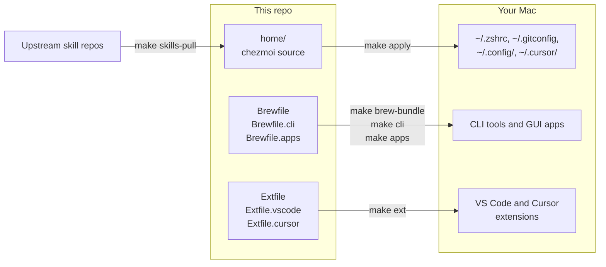

# dotfiles

Opinionated macOS dotfiles. [chezmoi](https://www.chezmoi.io/) manages the config for tools such as zsh, Starship, tmux, Ghostty, and git. Homebrew installs the tools and apps. One `Makefile` is the entry point for every task.

## How it works

The repo holds the setup you want. Each `make` target applies one part of it to your Mac.



Edit files in `home/`, never the live copies in `~`. For example, `home/dot_zshrc` becomes `~/.zshrc` when you run `make apply`.

## Set up a new Mac

```bash
git clone https://github.com/codecio/dotfiles ~/dotfiles
cd ~/dotfiles
make bootstrap
```

`make bootstrap` installs the Xcode Command Line Tools, Homebrew, and the core `Brewfile`, then applies `home/`. To add daily CLI tools, GUI apps, and editor extensions, run `make cli`, `make apps`, and `make ext`. The [bootstrap guide](docs/bootstrap.md) covers a Mac that already has Homebrew and the manual steps after bootstrap.

## Daily use

| Command | What it does |
|---------|--------------|
| `make diff` | Show what `make apply` would change |
| `make apply` | Apply changes from `home/` to your live files |
| `make lint test` | Run the checks that CI runs on every push and pull request |
| `make help` | List every target |

Settings for one machine go in `~/.zshenv.local` and `~/.zshrc.local`, outside the repo. Git picks your identity by directory, as the [chezmoi guide](docs/chezmoi.md) explains. Every other topic has a page in the [docs index](docs/README.md).
